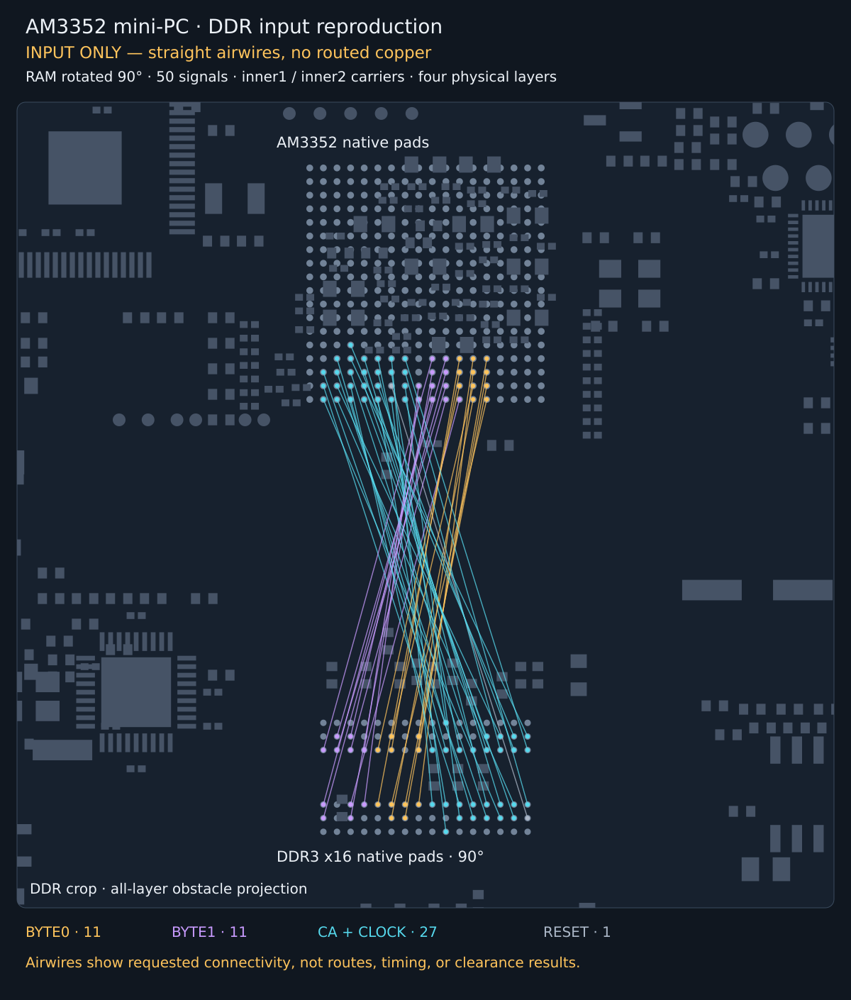

# AM3352 mini-PC: 50 DDR signals on inner layers

The captured AM3352 + 1 GB DDR3L layout has RAM rotated 90°, four physical
layers, and DDR carriers restricted to `inner1`/`inner2`. The fixture preserves
all 50 signals, 1,441 obstacles, three differential pairs, original timing
bounds, and 0.4/0.2 mm vias. It contains no supplied copper.

## Reproduce

```sh
bun scripts/repro-am3352-mini-pc-inner-layers.ts --timeout-seconds 240
bun test tests/am3352-mini-pc-inner-layers-repro.test.ts
```

The runner uses native `BusLanesPipelineSolver` defaults and exits nonzero for
incomplete or invalid routing. `--output` selects the JSON report destination;
it defaults to `.cache/am3352-mini-pc-inner-layers/repro.json`. Completed output
is checked for pad connectivity, inner-layer carriers, native DRC, self-shorts,
bus/pair matching and route quality. The compressed fixture is the exact input;
its hash and capture versions are recorded in the adjacent `provenance.json`.

## Input snapshot



This requested diagnostic follows the existing CA repro's input snapshot.
Colored lines are **airwires**, not a successful routing result. Regenerate with:

```sh
bun scripts/snapshot-am3352-mini-pc-input.ts
```

## Observed result

On bus-lanes 0.0.19 (`463734f`), both the released package and repository source
exhausted the 240-second budget in `lanes_route`: 100 automatic pad escapes,
**0/50 accepted routes**. The input remained unchanged. The existing benchmark
completed 5/9 cases; four timed out. Timing is machine/load dependent.

This captures a bounded-search failure. Complete-board electrical and physical
DDR timing qualification remain separate from the router's planar checks.
