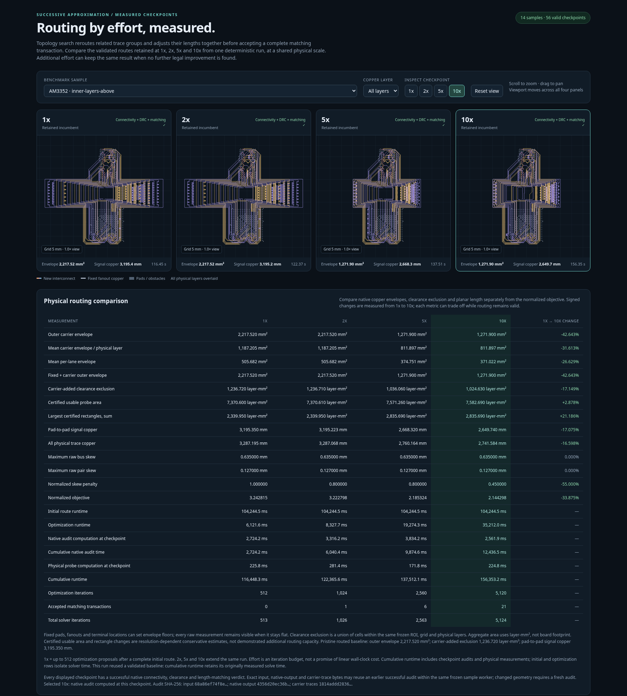

# Anytime bus routing with coordinated space allocation

The new search changes complete routing groups and the space they occupy. On AM3352 inner-layers-above, the genuine **1x → 5x** prefix reduces the outer carrier envelope **42.64%**, planar signal copper **16.49%**, and independently measured clearance exclusion **16.23%**. The **10x** continuation retains that envelope and reaches **17.08%** copper and **17.15%** exclusion reductions from 1x. All **14 samples × 4 efforts = 56** complete checkpoints pass their original native connectivity, DRC, matching, and pair checks; every earlier 1x, 2x, and 5x output is preserved byte-for-byte.

[Open the interactive comparison](index.html). Select a sample and copper layer, then pan or zoom the linked panels. Every checkpoint uses the same physical viewport. The report embeds exact full-precision routed geometry and runs offline in browsers supporting `DecompressionStream`.



Native review snapshots auto-fit each route. The interactive panels and this comparison screenshot use a shared viewport.

## Algorithm

1. Provide provisional endpoint connections immediately with `status: "best_effort"` and explicit violations. Obtain a valid incumbent using the existing initial router, preserving supplied fanouts and local escapes.
2. Discover empty coordinate strips crossed only by straight runs. Move all affected lanes together, collapsing compatible strips from the outside inward while anchoring terminals, vias, immutable copper, and package approaches. Explore cumulative and directional subsets in a bounded beam. Separately recover untuned skeletons and search shorter corridors by rerouting blocking nets together on coarse-to-fine visibility grids.
3. Close overlapping bus and differential-pair constraints into electrical cohorts. Compute a new common length-target vector. Reconstruct banks together across known and newly available pockets, using compact rounded/folded forms and clearance-derived density. Accepted banks can expand or contract their straight legs while retaining bend radii and longitudinal positions. Whole paired lobes can be removed without disturbing the remaining phase. Reserve future immutable handoffs and nonbank approaches during partial construction.
4. Rebase complete transactions onto the latest incumbent. Check original terminal/port identity, width, layer, ownership, immutable escape geometry, whole-copper matching, native continuous clearance, self-clearance, conventional angles, pair coupling, and accepted physical minimum pair gaps. A strictly valid, better transaction replaces the incumbent atomically.
5. Yield after bounded discovery and construction chunks. Continue the identical deterministic sequence at higher effort; failed scratch candidates leave the valid result available. The objective never increases after the first valid route.

The optimizer uses low-level geometry and its own transaction search. The original router creates the first incumbent; the original validator audits later candidates.

The configurable objective is

```text
areaWeight * normalizedArea + skewWeight * skewPenalty + lengthWeight * normalizedLength
```

Default weights are **1, 0.1, 0.2**. Area combines the outer copper envelope, mean physical-layer envelope, mean lane envelope, and mean clearance-exclusion union, normalized by the terminal envelope. Wire radii and via pads count. Tuning-bank rectangles are secondary diagnostics and have no effect on acceptance. Length includes immutable fanouts; skew is mean squared skew normalized by its declared tolerance, floored at minimum trace width. Individual components can trade off while the complete route stays valid.

The default cumulative budgets for **1x, 2x, 5x, and 10x** are **512, 1024, 2560, and 5120** optimization steps. Initial routing and independent validation are separate costs. `iterationsPerX` is configurable; a larger base can reach a compact result already at 1x. Additional effort can plateau and does not guarantee a global optimum or proportional elapsed time. `step()` supports external scheduling, and `runIterations(n)` continues beyond the presets.

## All existing positive samples

The table reports physical outer envelopes in mm², total planar signal copper in mm, and signed exclusion reductions from 1x to 10x. Exclusion is measured on one frozen conservative 0.1-mm probe per sample; its union counts overlapping exclusions once and subtracts immutable copper and board exclusions. Summed layer areas use layer-mm². These measurements are independent of the optimizer's score. Negative reductions show a component tradeoff.

| Sample | Signals | 1x envelope | 2x envelope | 5x envelope | 10x envelope | 1x → 10x envelope reduction | 1x → 10x copper | 1x → 10x exclusion reduction |
| --- | ---: | ---: | ---: | ---: | ---: | ---: | ---: | ---: |
| AM3352 / control | 47 | 412.370 | 412.370 | 412.370 | 412.370 | 0.00% | 1525.838 → 1531.983 | 0.02% |
| AM3352 / right | 47 | 660.450 | 660.450 | 660.450 | 660.450 | 0.00% | 1864.875 → 1876.432 | -0.48% |
| AM3352 / left | 47 | 568.859 | 568.859 | 568.859 | 568.859 | 0.00% | 1916.743 → 1927.418 | 0.48% |
| AM3352 / above | 47 | 638.400 | 638.400 | 638.400 | 638.400 | 0.00% | 2100.815 → 2096.189 | 1.52% |
| AM3352 / inner-layers | 47 | 474.662 | 474.662 | 474.662 | 474.662 | 0.00% | 1622.503 → 1628.758 | 0.24% |
| AM3352 / inner-layers-right | 47 | 908.315 | 908.315 | 908.315 | 908.315 | 0.00% | 2161.650 → 2164.828 | 0.07% |
| AM3352 / inner-layers-left | 47 | 1381.394 | 1381.394 | 1319.329 | 1196.935 | 13.35% | 2369.826 → 2221.133 | 8.45% |
| AM3352 / inner-layers-above | 47 | 2217.520 | 2217.520 | 1271.900 | 1271.900 | 42.64% | 3195.350 → 2649.740 | 17.15% |
| AM62L / ddr left io right | 33 | 233.303 | 233.303 | 233.303 | 233.303 | 0.00% | 2198.992 → 2201.992 | 0.36% |
| AM62L / ddr right io left | 33 | 144.907 | 144.071 | 138.572 | 138.602 | 4.35% | 2588.706 → 2590.663 | 6.53% |
| AM62L / ddr top io bottom | 33 | 208.073 | 201.084 | 201.122 | 201.122 | 3.34% | 2387.325 → 2374.703 | 6.33% |
| AM62L / ddr bottom io top | 33 | 424.898 | 424.898 | 424.898 | 424.898 | 0.00% | 2414.416 → 2415.191 | 0.52% |
| Three-lane obstacle channel | 3 | 14.688 | 14.688 | 14.688 | 14.688 | 0.00% | 30.787 → 30.787 | 0.00% |
| Skew tolerance / 0.5 mm | 2 | 31.973 | 31.973 | 31.973 | 31.973 | 0.00% | 20.000 → 19.980 | 2.76% |

The original 1x → 5x improvement remains intact: inner-above's mean layer envelope falls **31.61%**, mean lane envelope **25.89%**, and normalized objective **32.61%**. It regains **200.66 layer-mm²** of conservatively certified probe space. At 10x it regains **212.09 layer-mm²**, while its objective is **33.88%** lower than at 1x. Envelope reduction and usable space are distinct measurements.

The 5x → 10x continuation finds different improvements depending on the sample:

- **AM3352 inner-layers-left:** envelope shrinks another **9.28%**, planar copper **2.69%**, and exclusion **2.98%**. Its total envelope reduction from 1x reaches **13.35%**.
- **AM3352 inner-layers-above:** the outer envelope plateaus, but copper falls another **0.70%** and exclusion **1.10%**. BYTE1 skew halves to **0.3175 mm**, two pairs become effectively equal-length, and the normalized skew penalty falls from **0.8 to 0.45**. Maximum byte-bus/pair skews remain **0.635 / 0.127 mm**.
- **AM62L ddr right io left:** exclusion falls another **4.90%**, mean lane envelope **11.63%**, and objective **4.54%**. The outer envelope grows **0.02%** and copper grows **0.037%**, illustrating the scored tradeoff.
- **Obstacle channel and skew-tolerance sample:** the 5x and 10x outputs are byte-identical. Additional search has not found a better route; this does not establish global optimality.

All 14 objective sequences are nonincreasing. Minimum accepted physical pair gaps, fixed copper, terminals, vias, and package approaches remain unchanged.

All **56** checkpoints are native-valid; six repeat checkpoints reuse a prior validation only after exact output-byte equality. The previous **42** 1x/2x/5x output hashes match the reference export exactly. Exact gzip outputs, embedded report geometry, inputs, seeds, and frozen source are hash-checked. The measured source fingerprint is `24c9010ae5f567ab6e693c87c4cf350ebd60e75f268f2de057f220cc2beaf837`.

**Final visual and browser review passed.** All 56 routed PNGs were individually inspected. The genuine offline report passed checks across 14 samples, 82 layer switches, 56 effort switches, 1,232 displayed metric values, 210 summary values, and all 56 output/native-validation hashes. Responsive panels retain the same physical scale; four query-string cases passed, with zero runtime exceptions, console errors, or external requests. The self-contained HTML is 18.575 MiB.

The report reused pristine, hash-checked initial routes computed independently earlier in this session. It records initial routing, cumulative optimization, native validation, and physical measurement costs separately. A byte-identical checkpoint can report zero new validation time. Total checkpoint elapsed time includes initial routing and result-copy overhead. These loaded export timings are separate from the controlled performance measurements below; the final exporter ran **two** independent sample workers. No iteration-zero, partial, failed, or provisional routes are review artifacts.

## Controlled performance

[performance.json](performance.json) records three alternating before/after runs in fresh processes, with the same inner-above input, pristine seed, deterministic search prefix, and no other CPU-heavy jobs. Every checkpoint retains the exact route bytes, score bytes, iteration count, and complete search statistics. The table shows median **cumulative optimization** seconds, excluding initial routing and the initial seed audit.

| Effort | Previous kernel (s) | Current kernel (s) | Time reduction | Speedup |
| --- | ---: | ---: | ---: | ---: |
| 1x | 6.271 | 4.714 | 24.83% | 1.33× |
| 2x | 9.408 | 6.872 | 26.96% | 1.37× |
| 5x | 24.715 | 17.085 | 30.87% | 1.45× |

Strict native validation medians improve from **1.623 → 0.714 s** for inner-above, **1.410 → 0.633 s** for inner-left, and **0.643 → 0.356 s** for control, with exact output hashes retained. A separate single profiled fresh-routing run of inner-above improves **122.739 → 103.390 s** and preserves its exact route hash and **322,703** iterations. That single run is not a timing median, and no controlled 10x speedup has been measured.

The speedups come from reusing immutable geometry and scenes within a transaction, sharing copper indexes during large-group validation, and reducing grid-heap overhead. Pure wave memoization has a generator-local FIFO limit of **200,000 point references and 128 entries**, jointly across restoration and phase variants. Evicted and oversized waves are recomputed without changing candidate order or results. These limits bound retained wave-cache storage, not transient construction or all process memory. The reproducible export uses concurrency two to reduce aggregate memory pressure.

## Native initial routing benchmark

A fresh `./benchmark.sh` run on the current native router solves all eight placements with **47/47** signals, zero combined DRC errors, byte-bus skew within **0.635 mm**, and differential skew within **0.127 mm**. All **161** supplied power dogbones per placement and each input remain unchanged. [native-benchmark.json](native-benchmark.json) contains the complete checks and raw metrics. These loaded initial-routing runtimes are distinct from the frozen-seed anytime comparison and the controlled speed measurements.

| Sample | Connectivity | DRC errors | BYTE0 skew (mm) | BYTE1 skew (mm) | Maximum pair skew (mm) | Route seconds |
| --- | ---: | ---: | ---: | ---: | ---: | ---: |
| control | 47/47 | 0 | 0.635000 | 0.635000 | 0.126884 | 36.19 |
| right | 47/47 | 0 | 0.635000 | 0.635000 | 0.121802 | 67.01 |
| left | 47/47 | 0 | 0.635000 | 0.635000 | 0.127000 | 117.49 |
| above | 47/47 | 0 | 0.635000 | 0.635000 | 0.127000 | 129.40 |
| inner-layers | 47/47 | 0 | 0.635000 | 0.635000 | 0.127000 | 45.61 |
| inner-layers-right | 47/47 | 0 | 0.635000 | 0.635000 | 0.127000 | 55.66 |
| inner-layers-left | 47/47 | 0 | 0.635000 | 0.635000 | 0.127000 | 75.23 |
| inner-layers-above | 47/47 | 0 | 0.635000 | 0.635000 | 0.127000 | 96.26 |

The benchmark used a 360-second cap per placement. Completing these samples does not imply that every physical input has a legal route.

## Reproduce and use

```sh
bun scripts/compare-anytime.ts docs/anytime 512 --concurrency 2
bun test
bun run typecheck
bun run test:package
bun run format:check
./benchmark.sh --timeout-seconds 360 --require-all-solved
```

The exporter freezes source, inputs, and pristine seeds. It requires every native checkpoint to pass before writing routed artifacts, and verifies the frozen source again before publication. `--stage-only` retains the complete validated report privately for inspection before copying it into the review directory.

[measurements.json](measurements.json) records every raw bus/pair length, physical metric, objective component, budget, acceptance count, validation result, source fingerprint, and input/output hash. `outputs/<sample>-<effort>x.json.gz` contains the exact output SRJ. The public API and continuation example are in the [repository README](../../README.md#anytime-optimization).

Unsupported or physically impossible routing constraints retain a labeled provisional result. Such copper is not fabrication-ready. A valid incumbent is never replaced by that fallback. Tests cover strict candidate/seed acceptance, monotone and deterministic continuation, immutable ports/copper, routing retries, detached snapshots, paired topology changes, and coordinated space allocation. The existing regression suite and isolated Node, browser, and TypeScript package-consumer checks also pass.
