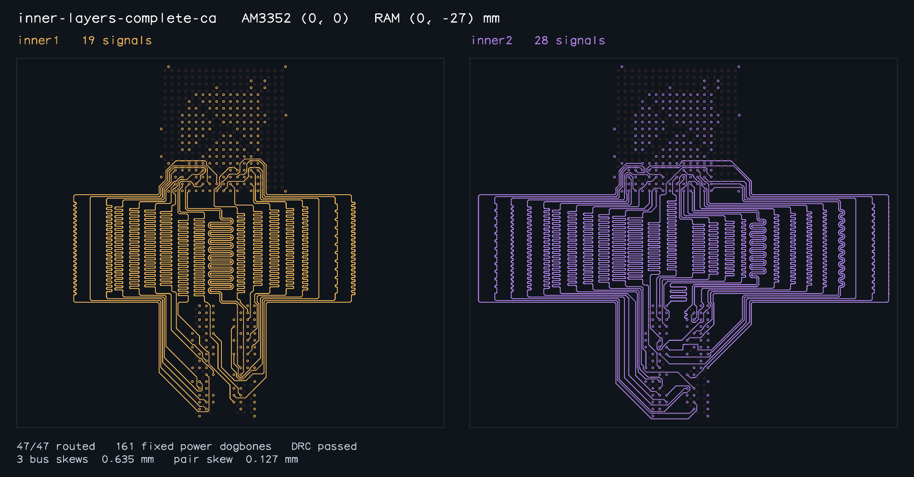

# Bounded tuning-bank envelope optimization

After a complete routed solution exists, shared-layer layouts with an untuned
carrier seed can try smaller interior tuning banks. This uses geometry generated
during the current solve; no stored sample coordinates or signal identities are
used by routing. A `TuningClearanceError` identifies lanes that need more space,
so the retry increases only their allocated width. Paired rails occupy one bank.

The default is two attempts. `maxEnvelopeAttempts: 0` or
`optimizeEnvelope: false` skips the optimization. Extra attempts are bounded to
at most four per candidate pitch and two pitches. Candidates must reduce the
complete signal-copper bounding-box area and pass carrier validation, full
native copper/connectivity, all declared skew checks and exterior coupling.
Endpoints, fixed fanouts, constraints and layer permissions remain unchanged.

The accepted copy is updated only after those gates. If iteration or wall-clock
budget ends during optimization, `tryFinalAcceptance()` returns the best accepted
copy. A smaller incomplete or invalid candidate cannot replace it. Benchmark,
reproduction and snapshot callers now invoke final acceptance at their deadline
before deciding whether routing failed; they still audit the returned copper.

## Measurements

The complete-CA signal envelope decreases **1521.211 → 1451.406 mm² (4.59%)**, with the same 47 signals on inner1/inner2 and all three timing buses. Its runtime increases **103.937 → 127.267 s (+23.330 s)**. The optimizer itself records **25.902 s**. Total signal copper length decreases from 3123.442 to 3032.826 mm.

The other eight signal envelopes remain unchanged. The inner-layer-left and inner-layer-above searches consume 6.687 and 13.586 seconds respectively without finding an accepted improvement; their original valid routes are retained.



The envelope is the bounding rectangle of complete signal copper, including
track/via radii and terminal escapes. It is not the occupied copper area. The
per-layer middle-region envelope is reported separately in the full JSON.

| Sample / routed snapshot | Before area (mm²) | After area (mm²) | Before time (s) | After time (s) | Time change (s) | Optimization work (s) |
| --- | ---: | ---: | ---: | ---: | ---: | ---: |
| [control](control-solved.png) | 412.370 | 412.370 | 25.020 | 22.061 | -2.959 | 0.000 |
| [right](right-solved.png) | 660.450 | 660.450 | 22.598 | 20.367 | -2.231 | 0.000 |
| [left](left-solved.png) | 568.859 | 568.859 | 27.666 | 27.398 | -0.268 | 0.000 |
| [above](above-solved.png) | 638.400 | 638.400 | 36.635 | 43.309 | +6.674 | 0.000 |
| [inner-layers](inner-layers-solved.png) | 468.312 | 468.312 | 36.360 | 37.648 | +1.288 | 0.000 |
| [inner-layers-right](inner-layers-right-solved.png) | 880.425 | 880.425 | 46.139 | 50.063 | +3.924 | 0.000 |
| [inner-layers-left](inner-layers-left-solved.png) | 983.289 | 983.289 | 62.186 | 69.268 | +7.082 | 6.687 |
| [inner-layers-above](inner-layers-above-solved.png) | 1184.358 | 1184.358 | 80.529 | 92.083 | +11.554 | 13.586 |
| [inner-layers-complete-ca](inner-layers-complete-ca-solved.png) | 1521.211 | 1451.406 | 103.937 | 127.267 | +23.330 | 25.902 |

Before: the final-acceptance parent branch, same machine and Bun 1.4.2 / Linux
x86_64. After: this branch's final source. Wall times vary with load, including
other validation jobs; the recorded optimization-stage time measures the actual
extra work directly. A zero optimization time means that routing path did not
provide an eligible full carrier seed, not a failed or omitted sample. Unchanged
envelopes are reported as unchanged even when optimization consumed time.

| Sample | Bus skews (mm) | DQS0 / DQS1 / CK skew (mm) |
| --- | --- | --- |
| control | 0.635000 / 0.635000 | 0.077868 / 0.126884 / 0.072830 |
| right | 0.635000 / 0.635000 | 0.096047 / 0.121802 / 0.102644 |
| left | 0.635000 / 0.635000 | 0.010514 / 0.127000 / 0.105429 |
| above | 0.635000 / 0.635000 | 0.127000 / 0.127000 / 0.127000 |
| inner-layers | 0.635000 / 0.635000 | 0.077868 / 0.126884 / 0.127000 |
| inner-layers-right | 0.635000 / 0.635000 | 0.123649 / 0.127000 / 0.127000 |
| inner-layers-left | 0.635000 / 0.635000 | 0.127000 / 0.127000 / 0.105429 |
| inner-layers-above | 0.635000 / 0.635000 | 0.127000 / 0.127000 / 0.127000 |
| inner-layers-complete-ca | 0.635000 / 0.635000 / 0.635000 | 0.020663 / 0.127000 / 0.072830 |

All nine cases pass 47/47 connectivity, native DRC, full configured pad-to-pad
skew and exterior coupling. Every fixed power dogbone and native input remains
unchanged. All nine fresh routed snapshots were individually inspected. The
exporter writes nothing until every declared sample passes all its checks.
[Full benchmark reports](benchmark-results.json) and
[before/after comparison](comparison.json) contain the measurements.

Validation: 290 tests, typecheck, formatting and package consumers pass. New
coverage exercises variable bank width with clear copper and preserved paired
rails; rejection of incomplete/disconnected/skewed/colliding candidates; and zero
search budget. A real complete-CA run with extra attempts was interrupted by the
BaseSolver iteration limit after its first improvement. The smaller route was
retained and independently passed native DRC, matching and coupling; see
[interruption report](interruption.json).

The CA/clock lengths remain above the SBC's 63.5 mm absolute ceiling. This change
improves envelope and relative-skew routing; it does not establish complete DDR
board compliance or change the SBC copper.

```sh
./benchmark.sh --require-all-solved --output optimized.json
./benchmark.sh --require-all-solved --no-envelope-optimization --output baseline.json
bun scripts/snapshot-routed-am3352.ts /tmp/optimized-am3352 180
```
