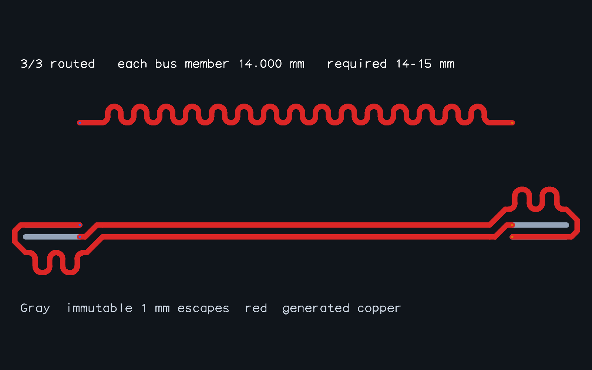

# Reserve differential clocks' absolute bus minimum

The coupled-pair router finished each pair with `buses: []`. That discarded its parent bus's absolute minimum until ordinary members occupied the remaining tuning space. Preserve positive-minimum bus constraints, restricted to the pair's members, during that early tuning step. Length measurements still include immutable supplied escapes; upper bounds and pair coupling/skew checks remain active.

The regression supplies two 1 mm fixed escapes per clock rail, an 8 mm terminal separation, and a 14–15 mm command/address bus interval. Previously the early pair result was only 10 mm pad-to-pad. Both clock rails now reach 14 mm before the address member is routed. The complete three-signal regression matches all members to 14 mm and checks physical visibility and immutable input copper.

## AM3352 validation and runtime

All nine declared samples complete 47/47 signals and pass independent connectivity, native combined-copper DRC, full-copper bus/pair matching and exterior coupling. The original input and all 161 fixed FanoutSolver power dogbones remain unchanged. Each final validation object and solver iteration count exactly equals the recorded main-branch baseline. These samples declare no positive bus minimum, so this change retains their previous search choices.

Times below compare the repository's recorded main baseline with this run in a shared Linux/Bun 1.4.2 environment. They are **not a controlled performance comparison or evidence of a speedup**. One initial `inner-layers-above` worker was killed with exit 137 during concurrent board work; its successful isolated rerun is reported. Other cases were not repeated. Original failure logs remain local; only complete validated outputs are review artifacts.

| Sample | Recorded main (s) | This run (s) | Connectivity | Native DRC errors |
| --- | ---: | ---: | ---: | ---: |
| [control](am3352/control-solved.png) | 58.607 | 41.565 | 47/47 | 0 |
| [right](am3352/right-solved.png) | 43.364 | 34.957 | 47/47 | 0 |
| [left](am3352/left-solved.png) | 69.312 | 48.102 | 47/47 | 0 |
| [above](am3352/above-solved.png) | 68.044 | 50.451 | 47/47 | 0 |
| [inner-layers](am3352/inner-layers-solved.png) | 106.225 | 62.284 | 47/47 | 0 |
| [inner-layers-right](am3352/inner-layers-right-solved.png) | 144.277 | 90.453 | 47/47 | 0 |
| [inner-layers-left](am3352/inner-layers-left-solved.png) | 282.030 | 193.645 | 47/47 | 0 |
| [inner-layers-above](am3352/inner-layers-above-solved.png) | 375.973 | 229.975 | 47/47 | 0 |
| [inner-layers-complete-ca](am3352/inner-layers-complete-ca-solved.png) | 425.074 | 304.379 | 47/47 | 0 |

| Sample | Bus copper skew (mm) | Pair copper skew (mm) |
| --- | --- | --- |
| control | 0.635000 / 0.635000 | 0.077868 / 0.126884 / 0.072830 |
| right | 0.635000 / 0.635000 | 0.096047 / 0.121802 / 0.102644 |
| left | 0.635000 / 0.511147 | 0.010514 / 0.127000 / 0.105429 |
| above | 0.635000 / 0.635000 | 0.127000 / 0.127000 / 0.127000 |
| inner-layers | 0.635000 / 0.635000 | 0.077868 / 0.126884 / 0.127000 |
| inner-layers-right | 0.635000 / 0.635000 | 0.127000 / 0.127000 / 0.127000 |
| inner-layers-left | 0.634990 / 0.634992 | 0.126990 / 0.000001 / 0.105429 |
| inner-layers-above | 0.634991 / 0.634993 | 0.126915 / 0.126990 / 0.000001 |
| inner-layers-complete-ca | 0.634990 / 0.634992 / 0.634994 | 0.075359 / 0.000000 / 0.066384 |

Bus limits are 0.635 mm and pair limits 0.127 mm; rounding in this table does not change acceptance tolerances. Original eight samples have BYTE0/BYTE1 timing buses; the ninth additionally includes the complete command/address bus. [Baseline](baseline.json), [new benchmark](benchmark.json), and [snapshot validation](validation.json) retain the full measurements.

All nine routed images were exported from completed benchmark results using the standard exporter, which revalidates the entire declared sample set before writing any image. Every image was visually inspected. A temporary local cache hook captured successful worker results after their measured solve and validation; the hook is not included in this change.

## Limits

This fixes early clock length reservation, not the complete AM3352 SBC. An isolated real-board command/address trial now reserves its 45.950034 mm clock minimum, but the full group remains unrouted and no new SBC DDR copper has been accepted. Benchmark success does not establish the board's TI absolute-length, impedance, return-path or native integration compliance.

Reproduce: `bun test tests/coupled-pair-bus-minimum.test.ts`, `bun run typecheck`, and `./benchmark.sh --require-all-solved --timeout-seconds 480`. Regenerate the standard nine-image gallery with `bun scripts/snapshot-routed-am3352.ts docs/pair-bus-minimum/am3352 480`.
