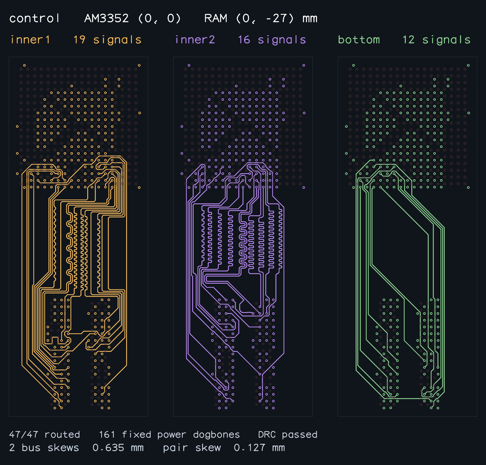
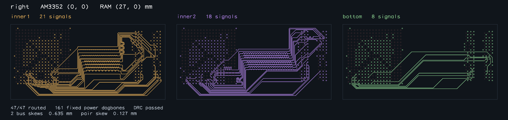
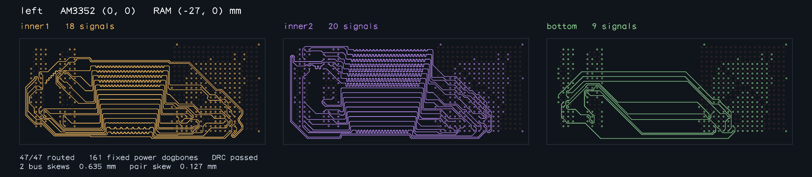
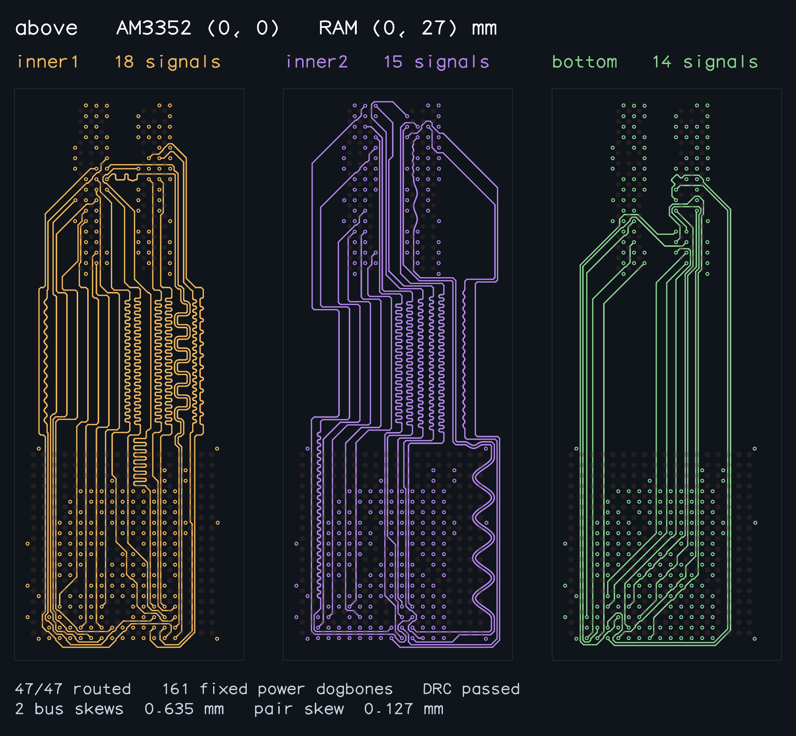
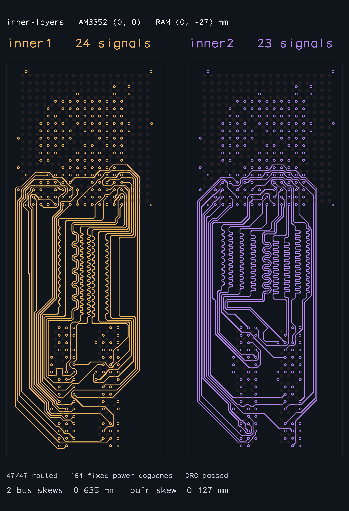
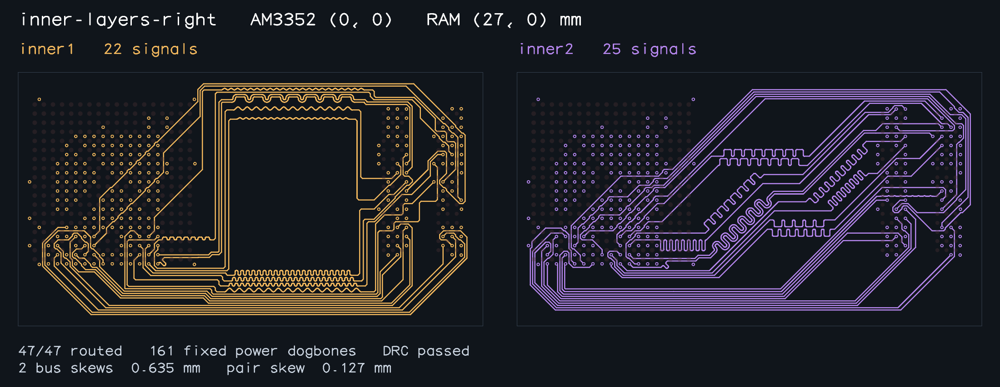
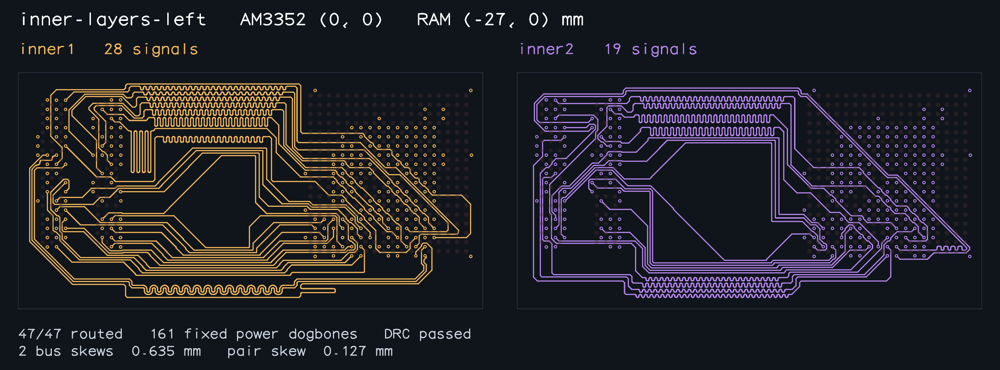
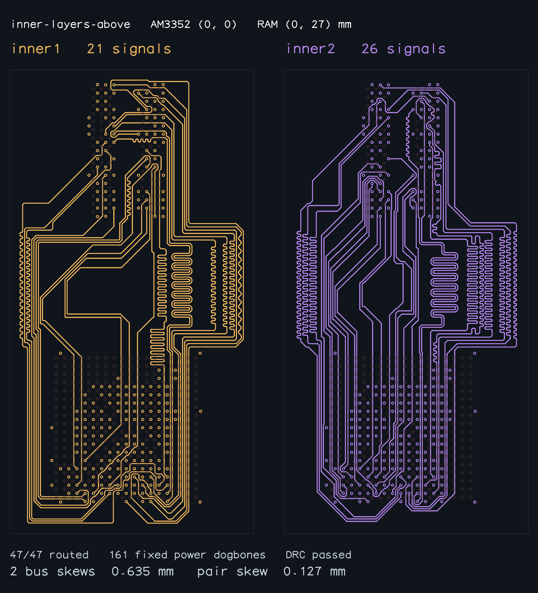
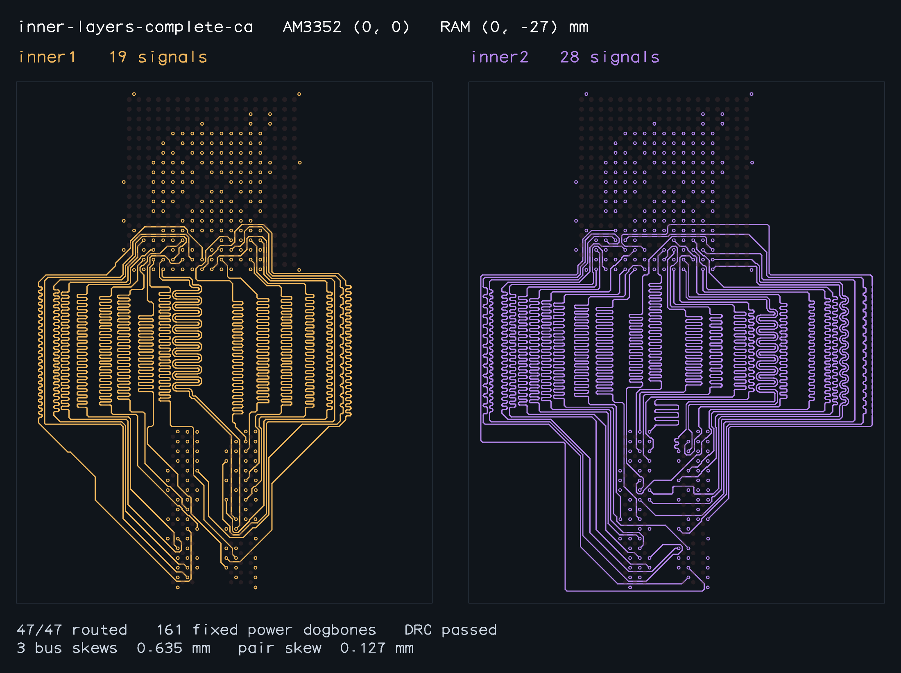
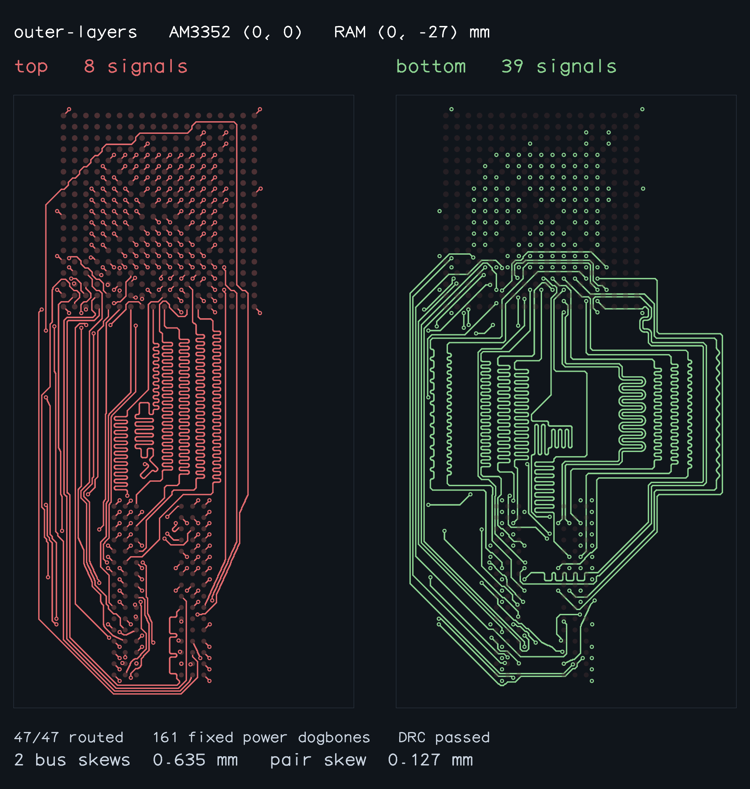

# Completed routes with the self-touching guard

All ten declared AM3352 samples have successful routes with complete connectivity, clean fixed and combined DRC, zero native complete-copper self shorts, and full pad-to-pad bus/pair length matching. Each retains all 161 immutable fixed power traces, vias and pad joins. Measurements include the fixed fanouts and terminal approaches. Bus skew limits are 0.635 mm; pair skew limits are 0.127 mm. `validation.json` records each bus and pair result.

The official gallery exporter independently revalidated every completed route before writing images. All ten PNGs were visually inspected. The panels show manufactured signal copper and via lands at a consistent physical scale within each sample. Only successfully completed routes are included.

## Benchmark evidence

Ran `./benchmark.sh --require-all-solved --output ...` for all ten samples with the new independent guard. Nine passed; the remaining `inner-layers-above` exhausted its search. After rebuilding provisional package tuning banks against completed neighboring copper, reran `./benchmark.sh --worker inner-layers-above` successfully. The table combines the nine successful full-run results with that successful rerun. The package-planning change applies to cross-row standalone pairs; the other nine layouts retain their established planning behavior. No clearance, length or coupling limit was relaxed, and no saved topology is used by the solver.

Also reran `inner-layers-left` and `inner-layers-complete-ca` with the final algorithm. Both passed and reproduced their previously validated route geometry exactly; their updated runtimes appear below.

All timings include routing, matching and envelope optimization. Runs shared the environment with other verification processes, so these are recorded wall times rather than isolated performance comparisons.

| Sample | Signals | DRC | Self shorts | TOTAL bus skew (mm) | Solve (s) |
| --- | --- | --- | --- | --- | --- |
| control | 47/47 | pass | 0 | DDR_BYTE0: 0.635000 DDR_BYTE1: 0.635000 | 69.532 |
| right | 47/47 | pass | 0 | DDR_BYTE0: 0.635000 DDR_BYTE1: 0.635000 | 66.508 |
| left | 47/47 | pass | 0 | DDR_BYTE0: 0.635000 DDR_BYTE1: 0.511147 | 97.884 |
| above | 47/47 | pass | 0 | DDR_BYTE0: 0.635000 DDR_BYTE1: 0.635000 | 91.353 |
| inner-layers | 47/47 | pass | 0 | DDR_BYTE0: 0.635000 DDR_BYTE1: 0.635000 | 104.273 |
| inner-layers-right | 47/47 | pass | 0 | DDR_BYTE0: 0.635000 DDR_BYTE1: 0.635000 | 147.076 |
| inner-layers-left | 47/47 | pass | 0 | DDR_BYTE0: 0.635000 DDR_BYTE1: 0.635000 | 277.499 |
| inner-layers-above | 47/47 | pass | 0 | DDR_BYTE0: 0.634990 DDR_BYTE1: 0.634993 | 219.689 |
| inner-layers-complete-ca | 47/47 | pass | 0 | DDR_BYTE0: 0.634990 DDR_BYTE1: 0.634992 DDR_ADDR_CTRL_CK: 0.634994 | 411.941 |
| outer-layers | 47/47 | pass | 0 | DDR_BYTE0: 0.635000 DDR_BYTE1: 0.635000 | 935.704 |

## Reviewed snapshots

### control

### right

### left

### above

### inner-layers

### inner-layers-right

### inner-layers-left

### inner-layers-above

### inner-layers-complete-ca

### outer-layers

